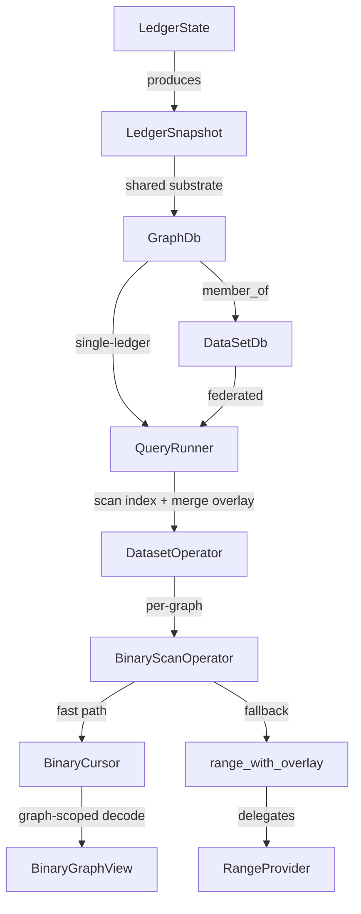

This document describes the **single query execution pipeline** in Fluree DB and how it combines:

- **Indexed data** (binary columnar indexes)
- **Overlay data** (novelty + staged flakes)

It also calls out where **graph scoping** (`g_id`) is applied so named graphs remain isolated.

## Pipeline overview

## Where this exists in code

- **API entrypoints**
  - `fluree-db-api/src/view/query.rs`: single-ledger `GraphDb` queries (`query`)
  - `fluree-db-api/src/view/dataset_query.rs`: dataset queries (`DataSetDb`)

- **Unified query runner**
  - `fluree-db-query/src/execute/runner.rs`
    - `prepare_execution(db: GraphDbRef<'_>, query: &ExecutableQuery)` builds derived facts/ontology (if enabled), rewrites patterns, and builds the operator tree.
    - `execute_prepared(...)` runs the operator tree using an `ExecutionContext`.

- **Dataset operator**
  - `fluree-db-query/src/dataset_operator.rs`
    - `DatasetOperator` wraps every triple-pattern scan. In single-graph mode (the common case) it passes through to one inner `BinaryScanOperator` with negligible overhead. In multi-graph mode (FROM/FROM NAMED datasets) it fans out one inner operator per active graph, drives their lifecycles, and stamps ledger provenance (`Binding::IriMatch`) on results that span multiple ledgers.
    - `DatasetBuilder` trait (factory pattern): the planner constructs a `ScanDatasetBuilder` at plan time; `DatasetOperator` calls `build()` at execution time during `open()` to produce per-graph `BinaryScanOperator`s.
    - Nested composition: inner operators can themselves be `DatasetOperator`s — provenance stamping passes `IriMatch` through unchanged.

- **Scan operators**
  - `fluree-db-query/src/binary_scan.rs`
    - `BinaryScanOperator` handles single-graph scanning only. Selects between binary cursor (streaming, integer-ID pipeline) and range fallback at `open()` time based on the `ExecutionContext`.

- **Range fallback**
  - `fluree-db-core/src/range.rs`: `range_with_overlay(snapshot, g_id, overlay, ...)`
  - `fluree-db-core/src/range_provider.rs`: `RangeProvider` trait implemented by the binary range provider

## Graph scoping (`g_id`)

Graph scoping is applied at two key boundaries:

- **Binary streaming path**: `BinaryCursor` operates on a `BinaryGraphView` (graph-scoped decode handle), ensuring leaf/leaflet decoding, predicate dictionaries, and specialty arenas are graph-isolated.
- **Range path**: `range_with_overlay(snapshot, g_id, overlay, ...)` passes `g_id` into the `RangeProvider`, which routes the range query to the correct per-graph index segments.

Overlay providers are **graph-scoped** at the trait boundary: the overlay hook receives `g_id` and must only return flakes for that graph. This keeps multi-tenant named graphs isolated even when overlay data is sourced externally.

## Overlay merge semantics (high level)

Both scan paths implement the same logical behavior:

- Read matching flakes from the **indexed base** (binary files)
- Read matching flakes from the **overlay** (novelty/staged)
- Merge them using `(t, op)` semantics so retractions cancel assertions as-of the query time bound

The details differ:

- `BinaryScanOperator` translates overlay flakes into integer-ID space and merges them into the decoded columnar stream.
- `RangeScanOperator` delegates to `range_with_overlay`, which combines `RangeProvider` output with overlay output.

## Planner fast paths

Before building the generic operator tree, `build_operator_tree_inner`
(`fluree-db-query/src/execute/operator_tree.rs`) runs a chain of `detect_*`
shape recognizers. When one matches, it builds a specialized `FastPathOperator`
that captures the slow generic tree as a `fallback`; the operator returns
`Ok(None)` from its `open()`-time closure to defer to that fallback whenever its
runtime preconditions do not hold. The whole chain is disabled in History mode
(`!planning.is_history()`).

Fast paths choose one of two overlay strategies (`fast_path_common.rs`):

- **strategy (a) — bail:** `fast_path_store` / `allow_fast_path` decline when
  there is uncommitted overlay (`epoch != 0`), `to_t < max_t`, multi-ledger, a
  `from_t`, or non-root policy. Used by base-only micro-optimizations.
- **strategy (b) — merge:** `allow_cursor_fast_path` admits overlay and
  time-travel because the operator reads through an overlay-merging
  `BinaryCursor` (`build_psot_cursor_for_predicate` /
  `build_post_cursor_for_predicate`) that folds novelty and honors `to_t`.

### Reverse-POST `ORDER BY DESC(?o) LIMIT k`

`detect_post_order_desc_limit` → `fast_post_order_limit::post_order_desc_limit_operator`.

Recognizes `SELECT ?s ?o WHERE { ?s 
 ?o [ ; ?s a <Class> ] } ORDER BY DESC(?o) LIMIT k`
(optional `OFFSET`/`DISTINCT`; `DISTINCT` requires `?o` projected). The POST
index is sorted `(p_id, o_type, o_key, o_i, s_id)`, so for a predicate whose
objects share one **order-preserving** `o_type` (numeric / temporal / boolean —
`fast_path_common::is_post_desc_orderable`), the physical tail of the predicate's
POST range is exactly the DESC top-k. The operator walks POST leaf entries from
the tail, decodes only the rows it keeps, and stops after `OFFSET + LIMIT`
survivors — avoiding a full-predicate drain into the top-k `SortOperator`.

Correctness is enforced at runtime (the detector is shape-only):

- A directory prepass proves the predicate's objects are a single
  order-preserving `o_type` before collecting. If they are not — dict-backed
  strings/refs (which sort *above* numerics/temporals), a mixed leaflet, or more
  than one `o_type` — the operator bails to the generic top-k rather than emit a
  wrong order. (A full prepass, not a streaming check, is required because the
  tail walk stops after `OFFSET + LIMIT` rows.)
- Profitability: for the `?s a <Class>` shape, `detect_post_order_desc_limit`
  consults `StatsView` and declines (defers to the generic plan) when the class
  is selective — i.e. the estimated tail rows to collect `OFFSET + LIMIT` class
  members (`need / (class_count / ndv_subjects(p))`) exceeds `class_count`, so
  anchoring on the class directly is cheaper. The bare shape (no class) always
  wins; missing stats fall through to a runtime scan budget that bails after a
  bounded number of inspected rows. (Note the detector already rejects any other
  pattern, so an arbitrary selective filter like `?s :employeeId 1234` never
  reaches this path — it goes to the generic planner, which anchors on it.)

The gate is `allow_cursor_fast_path` + `to_t >= index_t` (deep time-travel, which
needs the history sidecar, defers). Two lanes split on whether novelty is present:

- **Base lane** (`epoch == 0`, `to_t == index_t`): a plain reverse leaf-walk over
  the persisted index. Class membership uses `batched_lookup_predicate_refs`
  (persisted is exact here).
- **Overlay lane** (`epoch != 0`): the same reverse leaf-walk is merged, in
  descending value order, with the predicate's resolved novelty ops — a *row-set*
  merge (skip base rows retracted by overlay; add overlay asserts; dedup by the
  full V3 fact identity `(s_id, o_key, o_i)` within the single proven `o_type` —
  `o_i` keeps repeated/list values distinct), which sidesteps the "base + asserts
  − retracts" arithmetic pitfall that only afflicts overlay-aware *counting*.
  `rdf:type` class membership is likewise evaluated overlay-correctly (persisted
  base ± novelty type asserts/retracts), and novelty-only subjects are
  materialized through a novelty-aware graph view (the persisted-dict
  `encoded_sid` form would not resolve them).

