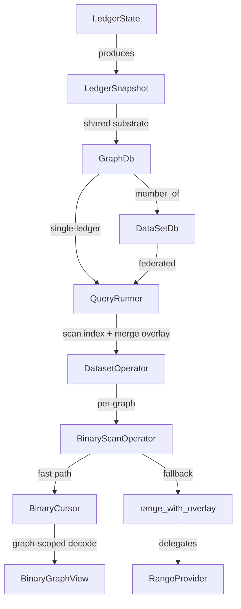

This document describes the **single query execution pipeline** in Fluree DB and how it combines:

- **Indexed data** (binary columnar indexes)
- **Overlay data** (novelty + staged flakes)

It also calls out where **graph scoping** (`g_id`) is applied so named graphs remain isolated.

## Pipeline overview

## Where this exists in code

- **API entrypoints**
  - `fluree-db-api/src/view/query.rs`: single-ledger `GraphDb` queries (`query`)
  - `fluree-db-api/src/view/dataset_query.rs`: dataset queries (`DataSetDb`)

- **Unified query runner**
  - `fluree-db-query/src/execute/runner.rs`
    - `prepare_execution(db: GraphDbRef<'_>, query: &ExecutableQuery)` builds derived facts/ontology (if enabled), rewrites patterns, and builds the operator tree.
    - `execute_prepared(...)` runs the operator tree using an `ExecutionContext`.

- **Dataset operator**
  - `fluree-db-query/src/dataset_operator.rs`
    - `DatasetOperator` wraps every triple-pattern scan. In single-graph mode (the common case) it passes through to one inner `BinaryScanOperator` with negligible overhead. In multi-graph mode (FROM/FROM NAMED datasets) it fans out one inner operator per active graph, drives their lifecycles, and stamps ledger provenance (`Binding::IriMatch`) on results that span multiple ledgers.
    - `DatasetBuilder` trait (factory pattern): the planner constructs a `ScanDatasetBuilder` at plan time; `DatasetOperator` calls `build()` at execution time during `open()` to produce per-graph `BinaryScanOperator`s.
    - Nested composition: inner operators can themselves be `DatasetOperator`s — provenance stamping passes `IriMatch` through unchanged.

- **Scan operators**
  - `fluree-db-query/src/binary_scan.rs`
    - `BinaryScanOperator` handles single-graph scanning only. Selects between binary cursor (streaming, integer-ID pipeline) and range fallback at `open()` time based on the `ExecutionContext`.

- **Range fallback**
  - `fluree-db-core/src/range.rs`: `range_with_overlay(snapshot, g_id, overlay, ...)`
  - `fluree-db-core/src/range_provider.rs`: `RangeProvider` trait implemented by the binary range provider

## Graph scoping (`g_id`)

Graph scoping is applied at two key boundaries:

- **Binary streaming path**: `BinaryCursor` operates on a `BinaryGraphView` (graph-scoped decode handle), ensuring leaf/leaflet decoding, predicate dictionaries, and specialty arenas are graph-isolated.
- **Range path**: `range_with_overlay(snapshot, g_id, overlay, ...)` passes `g_id` into the `RangeProvider`, which routes the range query to the correct per-graph index segments.

Overlay providers are **graph-scoped** at the trait boundary: the overlay hook receives `g_id` and must only return flakes for that graph. This keeps multi-tenant named graphs isolated even when overlay data is sourced externally.

## Overlay merge semantics (high level)

Both scan paths implement the same logical behavior:

- Read matching flakes from the **indexed base** (binary files)
- Read matching flakes from the **overlay** (novelty/staged)
- Merge them using `(t, op)` semantics so retractions cancel assertions as-of the query time bound

The details differ:

- `BinaryScanOperator` translates overlay flakes into integer-ID space and merges them into the decoded columnar stream.
- `RangeScanOperator` delegates to `range_with_overlay`, which combines `RangeProvider` output with overlay output.

